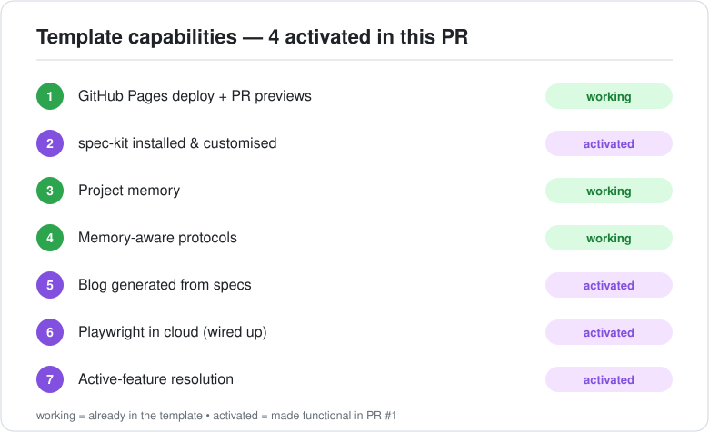
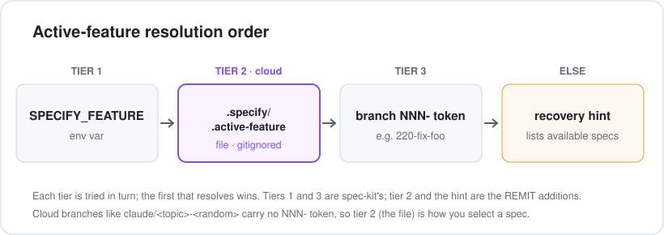

> **At a glance —** four of the template's seven capabilities went from *documented* to *working* in a single PR: spec-kit installed and customised, 3-tier active-feature resolution, blog auto-generation, and the Playwright `package.json`.

## The problem

REMIT was created from a reusable project-template repository that promises seven capabilities. But a *template* deliberately leaves some machinery uninstalled — spec-kit in particular is meant to be pulled fresh in each child project, never vendored. REMIT **is** that child project, so the "install me here" steps had simply never been run. Three capabilities worked (Pages deploy + PR previews, project memory, and the blog *publisher*); four were only prose in `CLAUDE.md`:

- **spec-kit** was not installed at all.
- **Active-feature resolution** named a `.specify/.active-feature` file that nothing actually read.
- **Blog auto-generation** had a publisher (`deploy.yml`) but nothing that *wrote* the posts.
- **Playwright** shipped a cloud wrapper and config — but no `package.json`, so nothing could run.

## Options

For the spec-kit-dependent gaps (resolution and blog generation) we weighed three approaches:

1. **Documentation only** — keep describing the patterns and let each developer wire them up. Truest to the template's "don't bake it in" stance, but nothing works out of the box.
2. **Adopt spec-kit's own mechanism** — use upstream's `.specify/feature.json` instead of the documented `.specify/.active-feature`. Less custom code, but it diverges from the contract that `CLAUDE.md` and `.gitignore` already promise.
3. **Install spec-kit and customise it** — make the documented behaviour real, keeping our additions in our *own* helper scripts so they survive upgrades.

Because REMIT is the concrete instance — the place where the patterns are meant to be *active* — we chose option 3.

## The strategy

Install spec-kit (`specify init --here --integration claude`), then layer small, clearly-fenced REMIT customisations on top:

- A standalone **`active-feature.sh`** helper implements tier 2 (read `.specify/.active-feature`) plus an "available specs + recovery hint" message; two tiny `REMIT addition` hunks in spec-kit's `common.sh` call it. Tiers 1 (`SPECIFY_FEATURE`) and 3 (the branch `NNN-` token) come from spec-kit itself.
- A **`blog-scaffold.sh`** helper seeds `specs/<spec>/blog/post.md` from the template; fenced steps in the `speckit-plan` / `speckit-implement` skills sketch and then write the post. The publisher (`deploy.yml`) was already correct, so it is untouched.
- A **`package.json`** declares `@playwright/test` + `@sparticuz/chromium` and the `test:e2e` scripts (wired up, not run).

Keeping the bulk of the logic in our own files means a future `specify init` re-run only needs a couple of fenced hunks re-applied — recorded in `decisions.md` (ADR-0004).

## The results

All four gaps are closed, and verified in-session:

- **Active-feature resolution** resolves correctly across all three tiers, and prints a helpful recovery hint (listing the available specs) when nothing matches a cloud branch like `claude/<topic>-<random>`.
- **This very post** was scaffolded by `blog-scaffold.sh` and resolved through the new `.specify/.active-feature` mechanism — capabilities #5 and #7 dogfooding each other.
- **Playwright** is one `npm install` away from running, with the cloud screenshot path intact.

And the proof you are reading right now: if this post is live at `/blog/001-spec-kit-activation/`, the blog pipeline — author under the spec, publish automatically on merge — works end to end.

## Screenshots

The 3-tier resolution order the patch implements. Tier 2 — the gitignored, per-worktree file — is the one that makes cloud sessions work, because their forced branch name carries no `NNN-` token:

