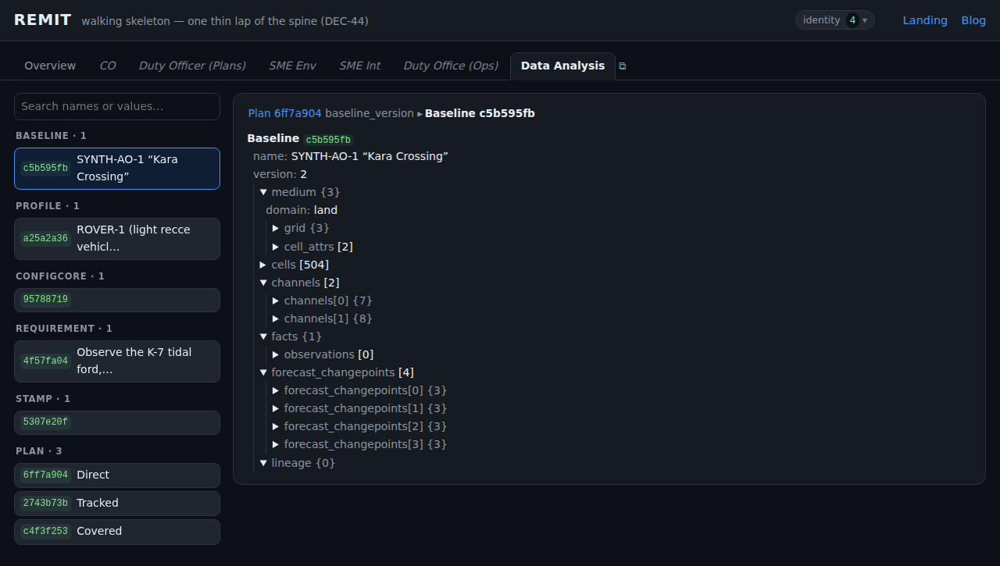
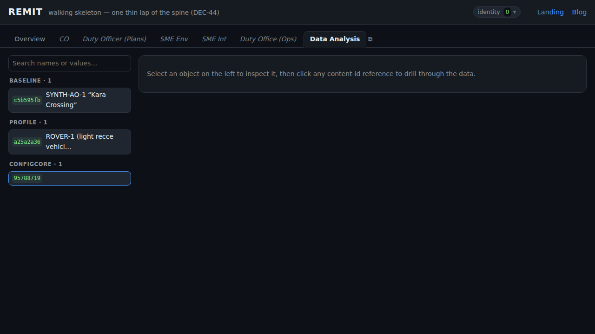
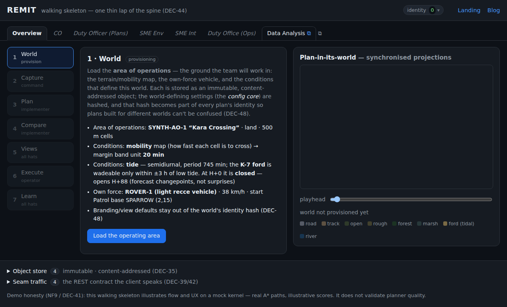

> **At a glance —** REMIT grew a tabbed, role-based shell over **one shared data store**, and the first new role — a **Data Analysis** drill-down — can **pop out into its own window and glow as the data changes while you drive the mission next door.**

## The problem

REMIT has been a single screen: one user, one seven-stage lap. But the target system is a
**command post** — many roles (CO, duty officers, SMEs) each looking at the *same* underlying
data through a different lens, updating it in their own scoped ways. We wanted to start making
that real without rebuilding the app: introduce **role-specific UIs over one central store**.

And there was a concrete frustration that crystallised the design: you can't *watch* the data
update and *drive* the changes at the same time when both live in one screen.

## Options

- **A second app instance / iframe per role.** Heavy, and each instance would have its own
  store — the opposite of "one shared store".
- **Swap the whole UI per role.** Loses the ability to keep the mission running while you
  inspect; no side-by-side.
- **A tab shell over one shared context, with surfaces that can pop out.** Every tab projects
  the *same* in-memory store; a popped-out tab reaches that store through `window.opener`, so
  it monitors live while the main window drives. This is exactly the shape DEC-61 anticipates
  (roles as config-declared surfaces over one content-addressed store), so we built the v1
  seed of it.

## The strategy

Four moves, all read-only this phase:

1. **Extract the shared context** — the one `ObjectStore`, `seam`, `world`, `playhead` — out
   of the monolith so every surface imports the same objects.
2. **Declare roles as config**: `{id, label, status, poppable, mount}`. Overview is the
   original UI (lazy-booted, untouched); five roles are labelled "coming soon"; **Data
   Analysis** is the first real alternative projection.
3. **Inject the context into each surface** (`mount(container, ctx)`), so the *same* surface
   renders the *same* live store whether it runs inline or in a popped-out window (where the
   pop-out passes `window.opener.__remit`).
4. **Make change visible**: because REMIT objects are immutable and content-addressed,
   "data changed" means *new ids appeared*. The monitor diffs the store and **glows** new
   rows and their type-group header — the same hook future mock feeds will fire on injection.

## The results

- A **seven-tab role bar** (ARIA tablist, keyboard nav, `#tab=` deep-links). Overview behaves
  exactly as before — the whole existing e2e lap passes unchanged.
- A **Data Analysis** drill-down browser over the shared store: an index grouped by type, a
  collapsible detail tree, and **clickable content-id references** that walk the object graph
  (Plan → stamp → Baseline → channel), with a breadcrumb trail and browser-style back.
- A **search box** that matches entity names *or* values, and a **yellow glow** on anything
  that changes — and its parents up the hierarchy.
- **Pop-out**: open the monitor in its own window, sharing the main window's live store. Drive
  the mission on the left, watch objects land and glow on the right.

It stays honest to the architecture: surfaces **read via projections** (NF1), and the first
DEC-61 **write** is now wired — denying cells in Plan is the *application of intel*, so it's
shared to the store as an attributed `SteeringDelta` and shows up live in the monitor (risk
appetites stay local — that's a ranking lens, not shared intel). The roles list stays UI-only
config (ADR-0012 §2), but the shared `SteeringDelta` is **modeled in LinkML** (`Delta` +
`SteeringDelta`, generated to TypeScript / JSON Schema / the HTML reference) — data types
belong in the source of truth (ADR-0011), not hand-shaped.

## Screenshots

