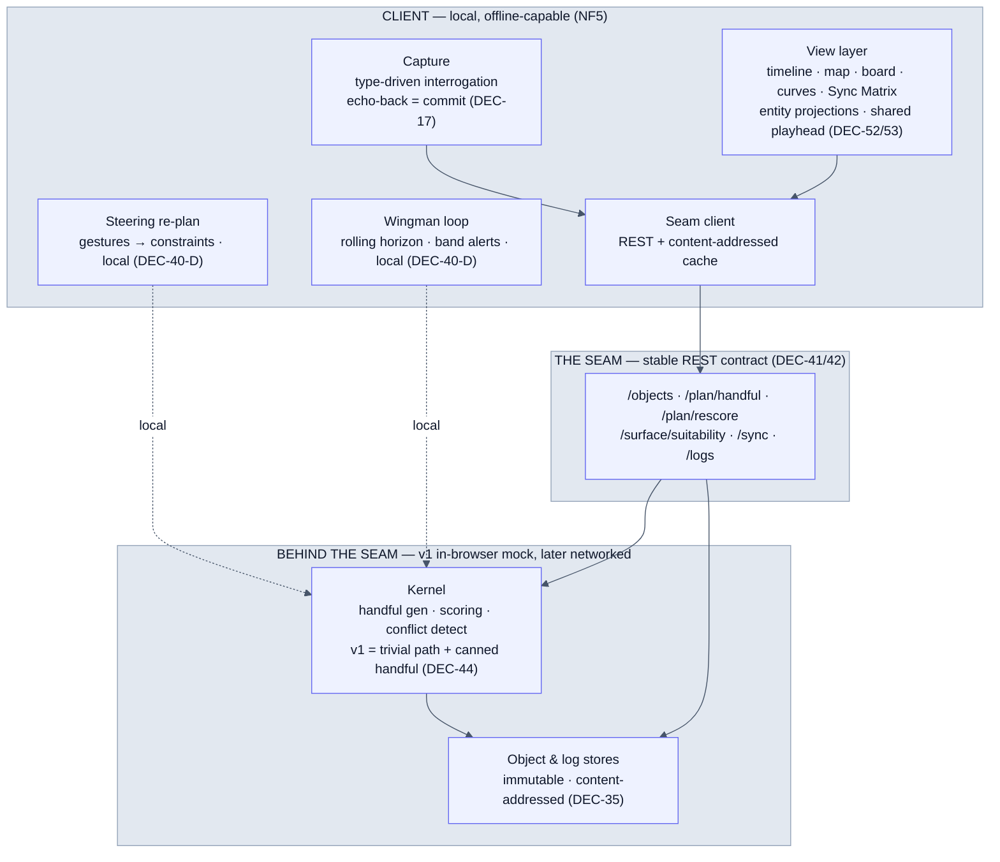
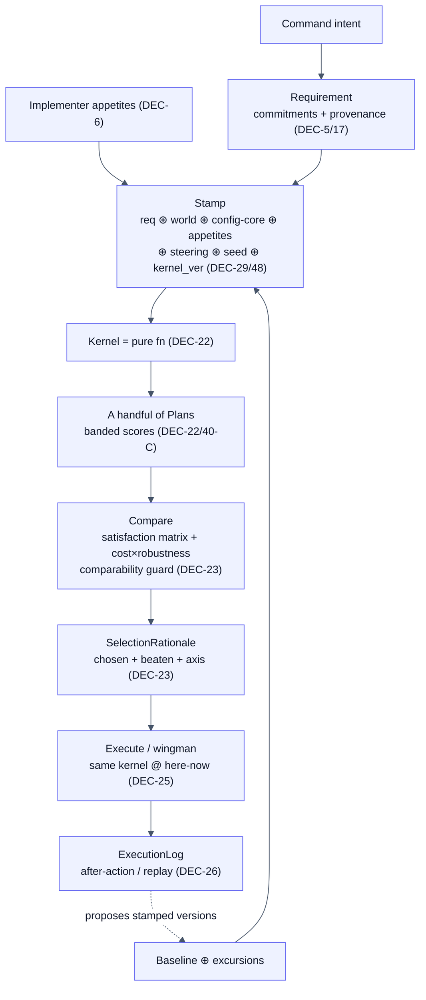
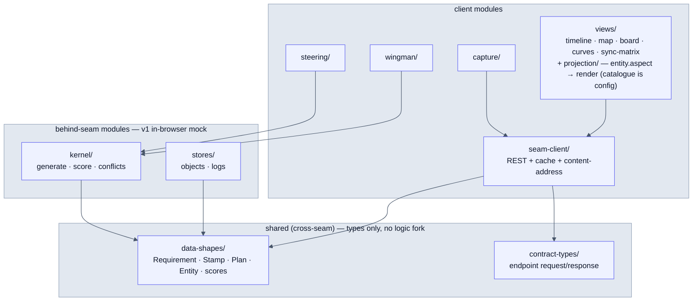

# REMIT — Architecture (draft 0.2)

*The runtime picture the register implies but does not draw. Detail lives elsewhere and is cross-referenced, not copied: semantics in `remit-concept.md`, shapes in `remit-data-model.md` v0.3, the interface in `remit-seam-contract.md` v0.1, rationale in `remit-register.md` (DEC-n). This document is structure only.*

*v0.2: views reframed as **entity projections of the plan-in-its-world** (DEC-52/53) — Sync Matrix added; NF1 restated over evaluated world+plan state. Diagrams restyled for legibility (top-down flowcharts, high-contrast light fills + dark text, shorter labels).*

---

## 1. Mental model (one paragraph)

The **mission requirement** is the primary, durable object; **plans** are candidate responses to it; the schedule, map, task board, Gantt and Sync Matrix are **synchronised projections of the plan-in-its-world** — projecting entities (own force, actors, features, phenomena) and the plan, not objects in their own right (DEC-5, reframed DEC-52/53). The system walks one lifecycle spine — **capture → model-world → plan → compare → execute → learn** — and every artifact on it is immutable, attributed and content-addressed (data-model rules 1–3). For the *why*, read the concept document; this document assumes it.

---

## 2. Runtime structure

Two halves divided by **the seam** (DEC-39). Everything heavy or persistent sits behind a REST contract; everything interactive or offline-critical sits in front of it.

**Reading the diagram.** The dotted edges are the DEC-40-D rule: interactive steering and the wingman's live loop call a *local* kernel implementation directly for latency (NF6) and offline (NF5) — they never round-trip the (possibly networked) seam. The solid edges are heavy/batch work that legitimately crosses the contract. In v1 *everything* behind the seam is an in-browser mock, so the distinction is architectural, not yet physical — but the boundaries are drawn now so the real services swap in later with no client change.

---

## 3. Data flow along the spine

How one mission moves through the components. Each arrow is an immutable object handed on (data-model §1–8).

The identity of a plan **is** its stamp (DEC-29): the materialised legs/schedule/scores are a regenerable cache. This is what lets a plan transit as a few hundred bytes (DEC-25) and replay perfectly (DEC-26) — and why "same stamp → same decision" must hold (NF3).

---

## 4. Architectural invariants (do not break)

These are not style preferences; the system's value collapses without them. Each names where it is enforced.

| Invariant | Statement | Enforcement point |
|---|---|---|
| **NF1 — single source of evaluation** | The optimiser and every view score through the *same* code, so "shown = optimised". **Scope widened (DEC-52):** views project the *evaluated world+plan state* (entities + plan), every track via that same code — domain larger, invariant unchanged. Holds *within* an implementation; the mock need not match the real kernel (DEC-41). | View layer calls the kernel's scoring/evaluation, never its own — for entity tracks too. |
| **NF3 — determinism** | Kernel is a pure function of its stamped inputs; same stamp/seed → same decision (decision-level, not bit-exact · DEC-13). | Kernel has no hidden state, clock or unseeded RNG. |
| **NF9 — honesty** | Satisfaction ≠ cost; confidence surfaced; "optimal *under these assumptions*"; the mock illustrates UX, it does not validate planner quality (DEC-41). | Comparison layer; demo-vs-spike evidence kept labelled (DEC-46). |
| **NF10 — big handfuls** | Costs/risks in uncertainty-sized bands; within-band plans are equal. Band widths derive from channel confidence, **not constants** (else the claim is hollow). | Scoring + band-calibration test (DEC-46). |
| **Constraints, never mutations** | Direct manipulation produces steering constraints that re-enter the kernel; a hand-edited plan is never persisted as a plan (DEC-24). | Steering module emits `Constraint`, re-plans. |
| **Identity is content** | Every immutable object's id = hash of canonical serialisation; names are aliases (DEC-35). | Store layer; canonical-JSON discipline. |

A useful test for any new code: *could a reviewer years later answer "why this plan, not that?" from the record alone?* If a change makes the answer "no", it breaks NF2/NF4 and the architecture.

---

## 5. Proposed module / boundary map

Boundaries mirror the seam so the eventual client/service split is a deployment choice, not a rewrite.

**Key boundary rules.**
- `data-shapes/` and `contract-types/` are the *only* things shared across the seam — the shared thing is the contract, **not** the implementation core (DEC-41). The mock kernel and the real kernel may diverge entirely below the shapes. The shapes themselves are generated from one LinkML schema (→ TypeScript for the client, Pydantic for any Python service) — DEC-57.
- `views/` depend on `seam-client/` and `data-shapes/`, never on `kernel/` internals — they render what the kernel scored (NF1) without re-deriving it.
- `steering/` and `wingman/` are the only client modules with a direct local-kernel dependency (DEC-40-D); they must keep working with zero connectivity.

---

## 6. v1 vs later (what's real now)

| Concern | v1 (walking skeleton · DEC-44) | Later |
|---|---|---|
| Kernel | TS in-browser; trivial real path + canned handful (DEC-41/44) | Real (cell,time) event search; language deferred, spike-informed (DEC-45) |
| Services behind seam | In-browser mocks | Networked services swap in, no client change (DEC-39) |
| World | Single synthetic baseline, one channel, small static grid | Real-terrain provisioned AOs; excursions; multi-channel (DEC-7/11/19) |
| Views | Timeline + map (skeleton) | + Sync Matrix & entity projection (first slice, DEC-53/54); then task board, state curves, tension view (DEC-24) |
| Activities | One `visit` type | Five+ richer; expressibility a blocking gate (DEC-16/46) |
| Comms | n/a (local) | Trickle delta/stamp sync (DEC-25) |

**First post-skeleton slices (DEC-54).** Two complementary, near-orthogonal slices are taken together after the skeleton: the **tidal-mudflat** slice (world/kernel side — provider tide channel, time-varying passability on (cell,time), hard-vs-soft on one cell) and the **entity/Sync-Matrix** slice (view/sourcing side — A6 projection model, D6 Sync Matrix, self + forecast + provider entity, display-only). Natural lean: mudflat first (proves the provider/computed-channel path the entity slice's provider entity then reuses).

---

## 7. Where to start

New developer, first day: read `remit-concept.md` for the *why*, then this document for the *shape*, then `remit-seam-contract.md` for the *interface you'll code against*. The first thing built is the **walking skeleton** (DEC-44) — the thinnest end-to-end path through §3 with every component present and trivially populated. The register (`remit-register.md`) is the architecture source of truth and is Doc-owned (DEC-37/47); implementation decisions live in the team tracker with the register upstream.
