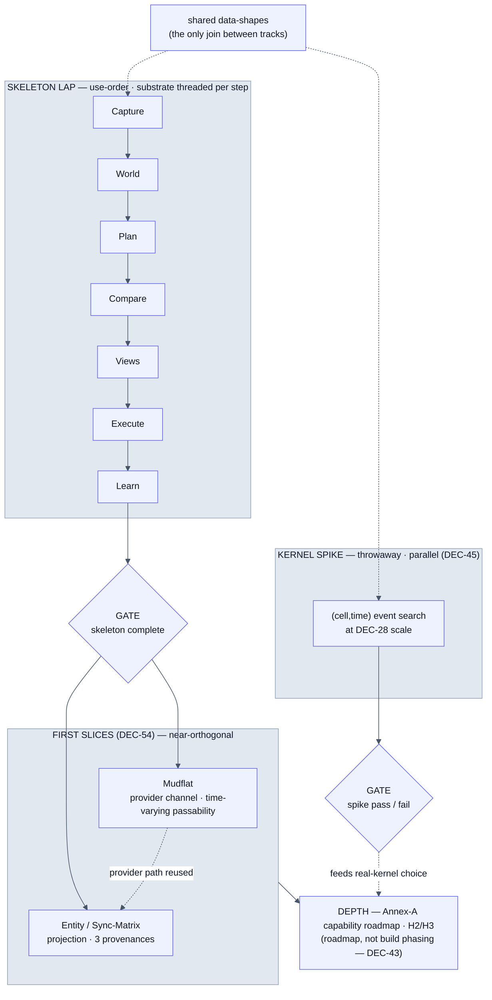

# REMIT — Build Plan (draft 0.4)

*The build/delivery view the register implies but does not sequence — the order work happens in, and the elements it creates. Detail lives elsewhere and is cross-referenced, not copied: methodology in `remit-register.md` (DEC-43…47/54), shape in `remit-architecture.md` v0.2 §5, interface in `remit-seam-contract.md` v0.2, shapes in `remit-data-model.md` v0.3, rationale in the register (DEC-n). This document is **order + inventory only**.*

*draft 0.3 — propagates DEC-57 (**data model is LinkML-sourced**: one schema → JSON Schema · TypeScript · Pydantic · HTML; `remit-data-model.md` becomes the generated view; a cross-language TS≡Python canonical-serialisation/identity spec is its companion) and DEC-58 (**development in Claude Code; GH repo = canonical home**).*

*draft 0.4 — propagates the **command-post stretch batch** (DEC-59/60/61, split horizon). Only the **shape-scaffolding** enters v1 — Entity `allegiance`; `Operation`/`EndState`/`SchemeOfManoeuvre` + `Role` + cross-role-delta-attribution **slots**; writes-as-stamped-deltas; role view-presets — as **not-preclude** plumbing under the DEC-56 freeze guard. The **capability** (portfolio Scheme search, capability-matched allocation, ORBAT authoring, bespoke surfaces, source-provider ingress, reactive red) is **designed-for, H2/H3** — Annex-A roadmap, not build phasing (DEC-43). Exact v1 build-depth per scaffolding item is a tracker call (DEC-47).*

*draft 0.2 — adds **shape-stabilisation precedes consumer fan-out** (DEC-56): the modules likely to churn the data-model (identity/canonical-form · kernel spike · Activity expressibility · the two DEC-54 slices) run ahead of the low-churn consumer stages (Compare/Views/Execute/Learn), which then fan out in parallel against fixtures — the freeze is earned, not declared.*

*draft 0.1 — initial issue. Spine = the system’s own **use-order** (capture → … → learn); the walking skeleton (DEC-44) is the first thin **lap** of that order; the cross-cutting substrate (store, stamp, seam endpoints, data-shapes) is **threaded per step**, not built up front; a **standing element inventory** (§3) is carried alongside the sequence.*

-----

## 1. Mental model (one paragraph)

The system’s logical **use-order** — capture → model-world → plan → compare → execute → learn (concept §1; architecture §1/§3) — is also the **build order**. The **walking skeleton** (DEC-44) is the first *thin lap* of that order: every stage present, trivially populated, working end-to-end. The cross-cutting **substrate** — content-addressed store, stamp, in-browser seam endpoints, the shared data-shapes — is *threaded in per step* rather than stood up first; each stage brings the minimum it needs, and earlier steps are revisited when a later stage reveals a requirement (the chosen trade: continuously demoable, at the cost of some upstream revision). Depth comes *after* the lap: first the two near-orthogonal **slices** (DEC-54), then the **Annex-A maturity layers** as a *capability roadmap, not build phasing* (DEC-43). The **kernel spike** (DEC-45) runs as a parallel throwaway track, sharing only the data-shapes. This document is **Doc-owned and upstream of the team tracker** (DEC-37/47): it names *what* is built and *in what order*; the tracker holds live status and implementation decisions, with the register as upstream source of truth. **Sequencing within that order (DEC-56):** because the shared data-shapes are the only join between tracks, the modules most likely to *change* those shapes — identity / canonical-form, the kernel spike, the Activity expressibility suite, then the two DEC-54 slices — run **ahead of** the low-churn consumer stages (Compare · Views · Execute · Learn), which then fan out in parallel against fixtures. The shape freeze is *earned* by running the stressors first, not declared up front; **use-order is the integration order, not the construction-dependency order.**

-----

## 2. How we build (by reference)

The methodology is already decided. This section **cites, never restates** — the rationale lives in the register.

|Aspect                                                             |Decision                |Source            |
|-------------------------------------------------------------------|------------------------|------------------|
|Skeleton first, then thicken by vertical slices                    |DEC-43                  |register          |
|Walking-skeleton scope (the lap’s per-stage stubs)                 |DEC-44                  |register          |
|Parallel kernel spike — throwaway, shares data-shapes only         |DEC-45                  |register          |
|Five-layer validation; **expressibility = blocking gate**          |DEC-46                  |register          |
|Review gates + batch reconciliation; register ↑ / tracker ↓        |DEC-47                  |register          |
|First post-skeleton slices (mudflat + entity/Sync-Matrix)          |DEC-54                  |register          |
|Shape-stabilisation precedes consumer fan-out                      |DEC-56                  |register          |
|Data model is LinkML-sourced (schema → JSON Schema · TS · Pydantic · HTML)|DEC-57                  |register          |
|Development in Claude Code; GH repo = canonical home               |DEC-58                  |register          |
|Annex-A maturity layers = capability roadmap, **not** build phasing|DEC-43 + concept Annex A|register / concept|
|Command-post stretch batch (Operation apex · ORBAT · role-interfaces; split horizon)|DEC-59/60/61|register|

-----

## 3. Element inventory — the “what”

Every element v1 brings into existence, keyed to its **home doc** and tagged with the lap step (or slice) that **first creates** it. The standing answer to “what exists overall” that the use-order spine would otherwise scatter down the timeline. *Legend for “First appears”:* a lap step (Capture / World / Plan / Compare / Views / Execute / Learn), a slice (Mudflat / Entity), or a later horizon (H2).

### 3A. Cross-cutting substrate (threaded — DEC-44, choice B)

|Element                                               |Home                      |First appears          |v1 form                         |
|------------------------------------------------------|--------------------------|-----------------------|--------------------------------|
|Canonical-JSON + content hashing                      |data-model rule 3 / DEC-35|Capture (first commit) |full; TS≡Python canonical-serialisation spec (DEC-35/57)|
|Object store — `PUT/GET /objects`, `exists`, `lineage`|seam §A                   |Capture                |mock, in-browser                |
|Log store — `/logs` append/get                        |seam §A                   |Execute                |mock, in-browser                |
|`seam-client/` (REST + content-addressed cache)       |architecture §5           |Capture, grows per step|mock                            |
|In-browser mock seam endpoints                        |DEC-39/41                 |threaded per step      |demo-only (DEC-41)              |
|Stamp (plan identity)                                 |data-model §6 / DEC-29    |Plan                   |full                            |

### 3B. Data shapes (`remit-data-model.md` v0.3)

*Per DEC-57 these shapes are generated from one LinkML schema (→ TypeScript for the client, Pydantic for any Python service); `remit-data-model.md` becomes the generated view, with a cross-language canonical-serialisation/identity spec as its companion (DEC-35). Service/function-valued fields and endpoints stay in the seam contract, not LinkML.*

|Element                                       |Home           |First appears|v1 form                                          |
|----------------------------------------------|---------------|-------------|-------------------------------------------------|
|Requirement · Commitment · Activity           |§1–3           |Capture      |one `visit`, one hard commitment                 |
|Baseline · Channel · MovementModel · Effect   |§4             |World        |single baseline, one channel, parametric movement|
|Profile · State (own-force)                   |§5             |World        |v1 state set                                     |
|Stamp                                         |§6             |Plan         |full (incl. `config_core_hash`)                  |
|Plan · Conflict                               |§7             |Plan         |banded scores, canned in skeleton                |
|SelectionRationale                            |§8             |Compare      |full                                             |
|ExecutionLog (Alert/Observation/Waiver/Replan)|§8             |Execute      |one band, manual observation                     |
|ChannelDelta (parametric)                     |§4 / DEC-34    |Mudflat      |first real use                                   |
|Excursion                                     |§4 / DEC-7     |—            |designed-for (H2); single-baseline in v1         |
|Entity · Aspect                               |§5A / DEC-52/53|Entity       |display-only, no cast-to-channel                 |
|Entity.allegiance (blue/red/green)            |§5A / DEC-60   |H2 (slot in v1)|attribute present; ORBAT authoring + stances designed-for|
|Operation · EndState · SchemeOfManoeuvre       |§1A / DEC-59   |H2 (slot in v1)|designed-for; portfolio search is kernel-released (DEC-51)|
|Role · cross-role Delta (attributed)          |§9 / DEC-61    |H2 (slot in v1)|writes-as-deltas path + role view-presets ride v1 scaffolding|
|Asset facet (capability · availability)       |§5A / DEC-60   |H2             |blue allocatable assets for Scheme allocation|

### 3C. Modules (`remit-architecture.md` §5)

|Module                                          |First appears         |v1 form                                                                  |
|------------------------------------------------|----------------------|-------------------------------------------------------------------------|
|`capture/`                                      |Capture               |scripted interrogation + echo-back (DEC-17)                              |
|`kernel/` (generate · score · conflicts)        |Plan                  |**mock**: trivial real path (small-grid A*) + canned handful (DEC-44)    |
|`stores/` (objects · logs)                      |Capture / Execute     |in-browser                                                               |
|`views/` (timeline · map · `projection/`)       |Views                 |timeline + map + shared playhead; `projection/` lands at the Entity slice|
|`data-shapes/` · `contract-types/` (shared core)|Capture, grow per step|the only thing shared across the seam (DEC-41)                           |
|`steering/`                                     |post-skeleton         |constraints → re-plan, local (DEC-24/40-D)                               |
|`wingman/`                                      |Execute               |simulated playback, local loop (DEC-25/40-D)                             |

### 3D. Seam endpoints (`remit-seam-contract.md` v0.2)

|Endpoint                                         |Layer|First appears    |v1 form                                                   |
|-------------------------------------------------|-----|-----------------|----------------------------------------------------------|
|`/objects` · `/logs`                             |§A   |Capture / Execute|mock, idempotent, content-addressed                       |
|`/plan/handful`                                  |§B   |Plan             |mock, async-capable shape + `strategy_seed`               |
|`/plan/rescore`                                  |§B   |H2               |amendment / new world version                             |
|`/surface/suitability`                           |§B   |H2               |C10 advisory (v1-lite later)                              |
|`/provider/channel/{id}/materialise` · `evaluate`|§D   |Mudflat          |mock tide channel                                         |
|`/provider/entity/{id}/track`                    |§D   |Entity           |mock ephemeris                                            |
|`/provider/movement/{id}/traverse`               |§D   |H2               |parametric movement in v1; networked traverse warned (NF6)|
|`/sync/push` · `/sync/pull`                      |§C   |H2               |skeleton is local; trickle comms later                    |
|`/plan/scheme-handful`                           |§B   |H2               |Operation -> banded Schemes; v1 mock canned (DEC-59)|
|`/provider/source/{id}/stream`                   |§E   |H2               |source-provider ingress; live/mock feed (DEC-61)|
|`/role/{id}/delta`                               |§E   |H2 (scaffold v1) |attributed cross-role write; the /sync path (DEC-61/25)|

### 3E. Providers & configuration (DEC-48…51, §G)

|Element                                                                                   |Home                  |First appears|v1 form                                                 |
|------------------------------------------------------------------------------------------|----------------------|-------------|--------------------------------------------------------|
|Sample **config core** (medium · channels · movement · provider decls · vocabulary) + hash|DEC-48 / G1           |World / Plan |the single file binding all tests; hash enters the stamp|
|Config **loader** (enforces core/shell split)                                             |DEC-48 / G1           |World        |the G4 conformance enforcement point                    |
|**Instance shell** (branding · endpoints · view defaults)                                 |DEC-48                |Views        |minimal; identity-free                                  |
|Parametric movement model (registry)                                                      |data-model §4 / DEC-49|World        |trivial parametric                                      |
|Mock **tide** channel provider                                                            |seam §D / G6          |Mudflat      |`materialise` + `evaluate`                              |
|Mock **ephemeris** entity provider                                                        |seam §D / DEC-53      |Entity       |`track`                                                 |

-----

## 4. The build sequence — the “order”

The skeleton lap, walked in **use-order**. Each step states what it **creates** (§3 elements), what substrate it **threads in** (choice B), and its **exit criterion**. Nothing is a “step 0”: the substrate accretes as each stage first needs it.

> **Shape-stabilisation runs ahead of the consumer fan-out (DEC-56).** The lap below is the *integration* order — not a ban on parallel construction. Data-model churn concentrates in a few places: (1) content-addressing / canonical serialisation + the Stamp/Plan identity split (DEC-35/29); (2) the **kernel spike** as the prime shape-stressor, not only a feasibility probe (DEC-45); (3) the Activity **expressibility** suite, pulled forward from the gates (§5) as a shape-hardener (DEC-46); then (4) the two DEC-54 slices (mudflat provider path; entity/projection). These run first; the low-churn **consumers** — Compare · Views · Execute · Learn — read the shapes those producers define and fan out in parallel against fixtures once the shapes settle. This *earns* the freeze rather than declaring it, and keeps fixture-divergence (each track coding to its own reading of the shapes) from surfacing only at integration.

### The lap

**1. Capture.**

- *Creates:* `capture/`; Requirement · Commitment · Activity (one `visit`, one hard commitment); scripted type-driven interrogation + canonical echo-back as the committing act (DEC-17).
- *Threads in:* canonical-JSON + content hashing and a bare object `PUT/GET` — the first committed object already needs identity (DEC-35); the `seam-client/` read/write path; the data-shapes core.
- *Exit:* a captured `visit` commitment is content-addressed, committed via echo-back, and retrievable by id.

**2. World.**

- *Creates:* Baseline (single synthetic baseline, one channel, small static grid — DEC-44/28); Profile + State (own-force v1 set); a trivial parametric MovementModel; the **sample config core** + loader enforcing the core/shell split (DEC-48).
- *Threads in:* more data-shapes; the `config_core_hash` readied for the stamp.
- *Exit:* baseline + profile resolve to a grid the kernel can search; the config core canonicalises and hashes.

**3. Plan.**

- *Creates:* `kernel/` as the **mock** — a trivial real path (small-grid A*) plus a canned banded handful and scores (an honest non-planner, NF9 / DEC-44); the **Stamp** (requirement ⊕ baseline ⊕ config-core ⊕ appetites ⊕ steering ⊕ seed ⊕ kernel-version — DEC-29/48); Plan · Conflict; `/plan/handful` (mock, async-capable shape, `strategy_seed`).
- *Threads in:* the stamp written to the store; `Plan.id = hash(Stamp)`.
- *Exit:* a stamp yields a handful of banded plans; re-running the same stamp reproduces the same decision (NF3, decision-level).

**4. Compare.**

- *Creates:* a tiny A2 satisfaction matrix (plans × the one commitment: verdict + margin band); the comparability guard on the full stamp basis incl. config core (DEC-23/48); SelectionRationale capturing chosen + beaten + deciding axis.
- *Threads in:* the rationale written to the store.
- *Exit:* the handful is compared, one plan selected, the rationale committed and auditable (NF2).

**5. Views.**

- *Creates:* `views/` — timeline + map with a shared playhead (DEC-44); rendered through the *same* evaluation code that scored the plan (NF1 — views project, never re-derive).
- *Threads in:* the `seam-client/` read-path for plan + scores; a minimal instance shell.
- *Exit:* timeline and map render the selected plan from kernel-scored data; scrubbing the playhead moves the map ghost — *shown = optimised*.

**6. Execute.**

- *Creates:* `wingman/` in simulated-playback mode (DEC-25/44); one margin band with **alert iff the band is crossed** (E3); optional manual observation (E5); the log store + `/logs` append; ExecutionLog.
- *Threads in:* the append-only log store.
- *Exit:* playback runs the plan against the requirement, one band degrades into one alert, and a manual observation appends to the log.

**7. Learn.**

- *Creates:* the after-action record = execution log + selection rationale (F1); perfect replay via stamp + NF3.
- *Threads in:* nothing new — reads the existing store and log.
- *Exit:* the mission replays from its stamp; the after-action record exists and reconciles plan-vs-actual.

**Skeleton-complete gate (DEC-47).** The spine runs end-to-end and the cross-cutting invariants demonstrably hold across the lap: content-addressing, stamp-as-identity, NF1 (shown = optimised), determinism (decision-stable), the seam contract, and offline via the in-browser mock. Scope: single user · land · vehicle.

### In parallel — the kernel spike (DEC-45)

A throwaway track sharing only the data-shapes. Success criteria (DEC-45): a sensible multi-activity plan at DEC-28 scale (10k–40k cells, ≤14 d, ~20–30 commitments); handful in seconds (NF6); waiting-as-a-move and threshold-injected exogenous events both work; banded non-domination yields a distinct handful; decision-stable. The **spike pass/fail gate** informs the real-kernel language/architecture choice (DEC-41) — it does not gate the skeleton.

### After the lap — depth

**First slices (DEC-54), near-orthogonal:**

- **Mudflat** (world/kernel side). Time-varying passability via the tide **provider** channel (`materialise` + `evaluate`) and a *composed* predicate atom — not a scripted clock-toggle, so the computed-channel seam is genuinely exercised (G6 condition 1); hard-vs-soft on one cell at the window **shoulder** (G6 condition 2); waiting-as-a-move over time-varying passability. The `(cell, time)` state makes the “stranded mid-flat” plan infeasible for free. Brings the §D provider seam and parametric ChannelDelta into use.
- **Entity / Sync-Matrix** (view/sourcing side). The A6 projection model and D6 Sync Matrix; self-entity + one hand-authored forecast entity + one mock-provider ephemeris entity; all three provenances exercised; display-only (no cast-to-channel in v1). Brings Entity/Aspect, `projection/`, and the `track` provider into use.
- *Natural lean (DEC-54):* mudflat first — it proves the provider/computed-channel path the entity slice’s provider entity then reuses. Fine ordering (parallel vs mudflat-then-entity) is a team-tracker call (DEC-47).

**Command-post layer (DEC-59/60/61) — split horizon.** *Into v1 as not-preclude scaffolding:* Entity `allegiance`; `Operation`/`EndState`/`SchemeOfManoeuvre` and `Role`/cross-role-`Delta` **slots**; writes-as-stamped-deltas over the single shared store; role view-presets + write-scopes. *Designed-for (H2/H3):* Operation→Scheme portfolio search (a kernel discipline, DEC-51), capability-matched force allocation, the ORBAT authoring page, bespoke **registered** role surfaces (release-then-compose), source-provider ingress, and a reactive/adversarial red force. **DEC-56 guard:** the new slots are designed-for additions and must ride the same shape-hardening discipline — they do **not** trigger a premature core-shape freeze, and the exact v1 build-depth per scaffolding item is a tracker call (DEC-47).

**Then** depth proceeds per the Annex-A maturity layers (H2/H3) — a **capability roadmap, not build phasing** (DEC-43). Each later capability follows the same discipline: thicken one seam at a time, behind the stable contract.

-----

## 5. Gates & handoff

**Review gates (DEC-47):** skeleton-complete · spike pass/fail · each vertical slice. At each gate the team challenges before the next commit; build discoveries that contradict a DEC are held as **local deviations and reconciled in batch** at the gate, with Doc recording any resulting amendments.

**Validation hooked to the gates (DEC-46):**

- Golden-fixture tests — pin a stamp, assert the selected plan + commitment verdicts (decision-level, DEC-13).
- Worked-examples acceptance suite — H1 must pass; H2/H3 run as **expressibility checks**; the expressibility suite is a **blocking gate** (the Activity model must always represent the five richer activities).
- Contract-conformance — content-addressing idempotency, stamp-compat flag, async shape, `batch ≡ materialise` (binds the mock and any real service).
- Demo-honesty guard — demos validate UX/flow only; the spike validates kernel feasibility only; evidence streams kept separately labelled (NF9 / DEC-41).
- Band-calibration — band widths derive from channel confidence, not constants (NF10).

**Register ↑ / tracker ↓ (DEC-47).** This document stays **static and design-level**: the order and the element inventory. The **team tracker** holds live status and implementation decisions, with the register as upstream source of truth. In short: this doc says *what* is built and *in what order*; the tracker tracks *whether* it is built. Both now live in the GH repo and the build proceeds in Claude Code (DEC-58); the project-knowledge copies are a mirror.

-----

## Open items (0.3 → 0.4)

- Fine ordering of the two DEC-54 slices (parallel vs mudflat-first) — a team-tracker call (DEC-47).
- Fixture conventions for the consumer fan-out (Compare/Views/Execute/Learn coded against canned shapes before the producers finalise) — a tracker call (DEC-47).
- Per-step **exit criteria** will sharpen once the skeleton build starts (the cost side of choice B — “revisit earlier steps”).
- The element inventory (§3) will accrete H2+ rows as depth work is scoped; the v1 rows are firm.
- Whether the spike’s outputs (real-kernel language/architecture) feed back a build-plan revision after the spike gate (DEC-45/41).
- Two-repo CI wiring for the alternate-config demonstrator (DEC-48 / G4 / K3) — not a v1 lap concern; noted for completeness.
- Command-post (DEC-59/60/61): which scaffolding slots are scaffolded *during the lap* vs *at the first depth slice* — a tracker call (DEC-47); `SchemeStamp` / canonical-serialisation impact on the DEC-56 stressor set.