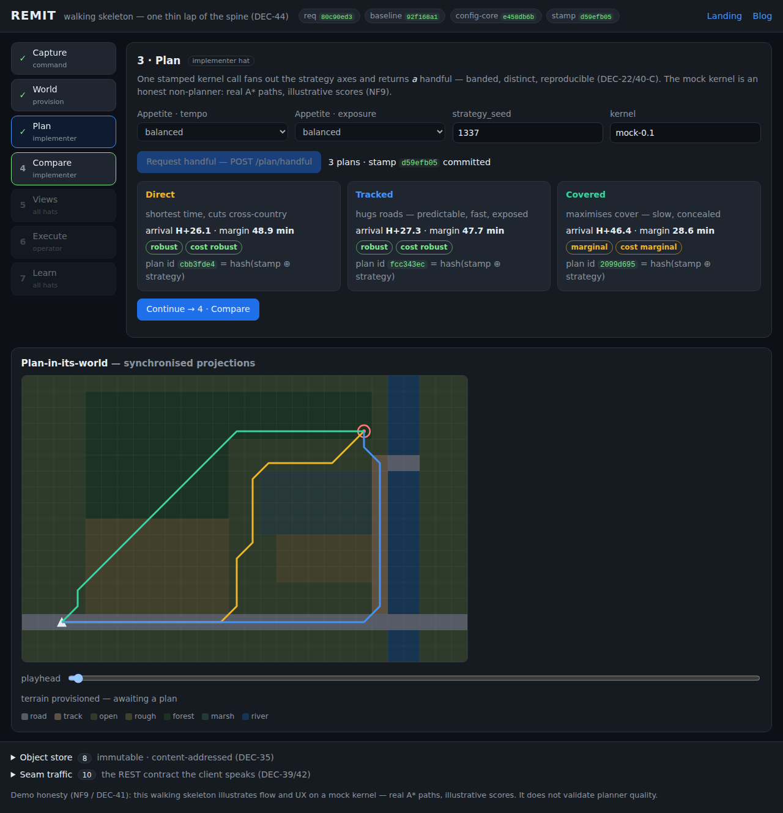
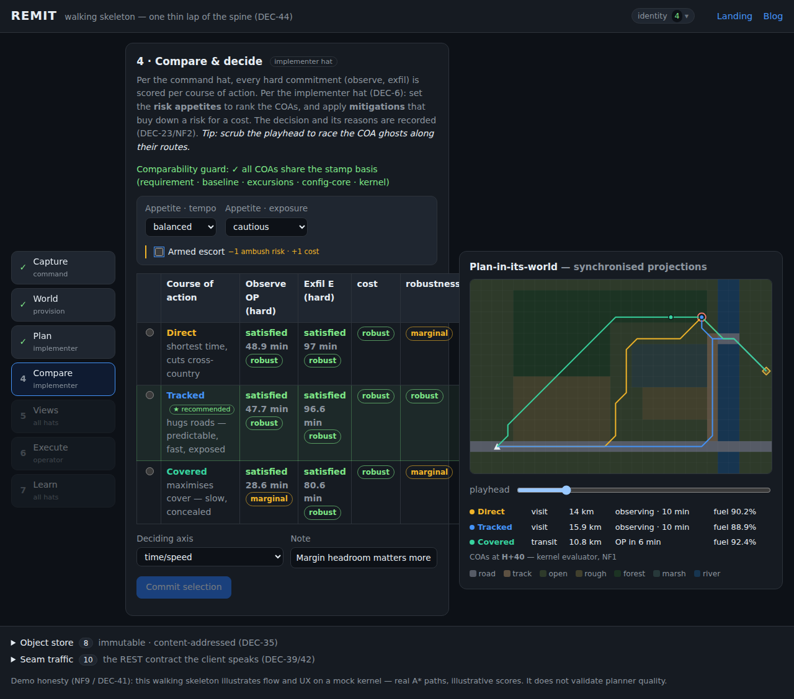
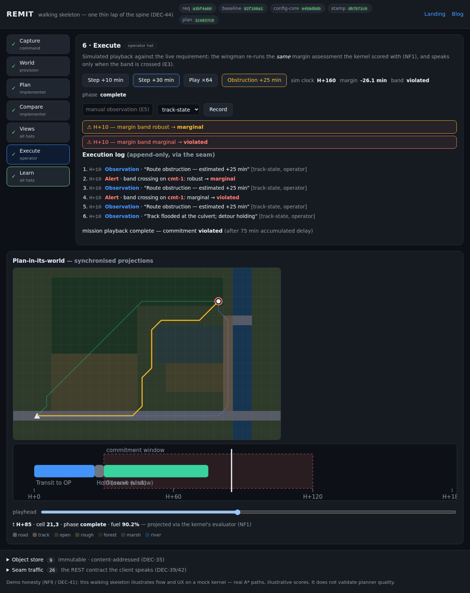
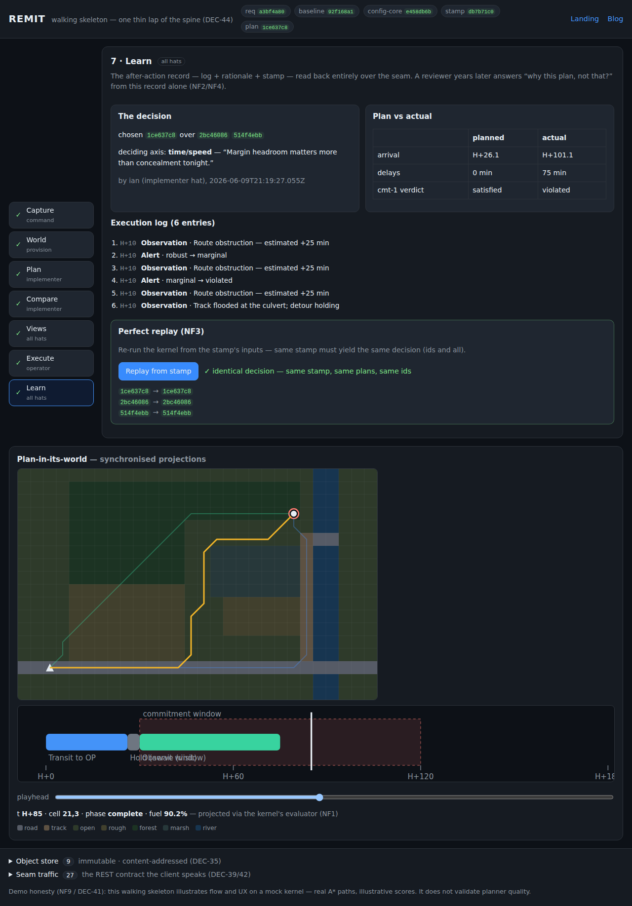
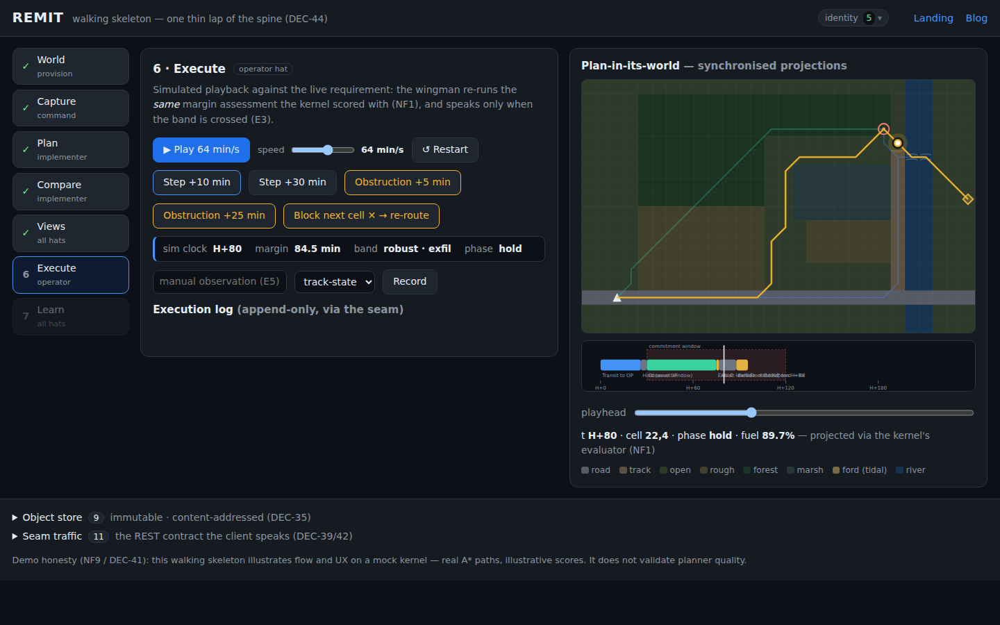

> **At a glance —** one stamped kernel call now fans out three genuinely different
> routes — fast, tracked, covered — and the whole lifecycle runs end-to-end in the
> browser: capture → world → plan → compare → views → execute → learn, with replay
> from the stamp reproducing the identical decision.

## The problem

REMIT's register had decided *what* to build in unusual depth — fifty-eight decisions
covering the requirement-first ontology, the seam, stamps, bands, honesty rules — but
none of it had ever run. The riskiest thing in a decision-heavy project is finding out
late that the decided pieces don't actually join up. DEC-43/44 prescribe the antidote:
a **walking skeleton** — every stage of the lifecycle spine present and trivially
populated, working end-to-end, before any stage gets deep.

## Options

- **Thicken one stage first** (e.g. a real planner, then the rest) — rejected by
  DEC-43: integration risk surfaces last, exactly where it hurts.
- **Mock everything including the paths** — rejected by DEC-44's own wording: a
  *trivial real path* keeps the map legible without faking planner quality (NF9).
- **One thin lap with per-stage stubs and the substrate threaded in per step** —
  chosen (DEC-44, choice B): content-addressed store, stamp, seam endpoints and data
  shapes each arrive at the step that first needs them.

A repo-local choice rode along: the deploy pipeline here publishes `app/` with **no
build step**, so the skeleton ships as plain ES modules (JSDoc-typed) rather than
DEC-41's TypeScript — recorded as a deviation to reconcile at the skeleton gate
(ADR-0005, DEC-47).

## The strategy

Walk the system's own use-order, committing real artifacts at every step:

1. **Capture** — scripted interrogation of one `visit` activity; defaults visibly
   stamped; the canonical echo-back *is* the committing act (DEC-17). The requirement
   becomes a content-addressed, immutable object (DEC-35).
2. **World** — a hand-authored 28×18 synthetic AO (roads, wood, marsh, the river
   Kara) with one `mobility` channel; the world-defining config core canonicalises
   and hashes into the stamp (DEC-48).
3. **Plan** — the mock kernel: deterministic A* under three strategy biases
   (time / roads / cover — DEC-22's fan-out), real paths, banded scores, and a
   **stamp** as plan identity (DEC-29).
4. **Compare** — the A2 matrix, the comparability guard, and a selection rationale
   recording chosen + beaten + deciding axis (DEC-23, NF2).
5. **Views** — map + timeline as synchronised projections with a shared playhead,
   rendered through the kernel's own evaluator: *shown = optimised* (NF1).
6. **Execute** — simulated playback re-anchoring the same evaluator; one margin
   band; an alert **iff** the band is crossed (E3); manual observations append to
   the log (E5).
7. **Learn** — the after-action record read back entirely over the seam, and
   **replay from the stamp** reproducing the identical plan ids (NF3).

Everything heavy sits behind in-browser mock seam routes (`PUT /objects`,
`POST /plan/handful`, `/logs/…` — DEC-39/41/42), and the app's footer drawers show
the object store and seam traffic live, so the substrate is visible, not asserted.

## The results

- The lap runs end-to-end in the browser with **zero build step** — and the demo is
  honest: illustrative scores are labelled, robustness bands say "canned", and the
  footer carries the NF9 disclaimer.
- The three strategies produce **three distinct routes** on the same stamped inputs,
  with margins banded by a unit derived from channel confidence (NF10).
- Injecting obstructions during playback walks the margin band down —
  robust → marginal → violated — firing exactly one alert per crossing, all in the
  append-only log.
- **Replay works:** re-running the kernel from the stamp yields the same plan ids,
  asserted in CI (Playwright) and clickable in the Learn stage.
- Two register feedback items surfaced exactly as a skeleton should surface them:
  the data-model Stamp needs a **profile/start-state axis**, and `Plan.id =
  hash(Stamp)` needs a **within-handful discriminator** (we used
  `hash(stamp ⊕ strategy)`). Both are held for the gate per DEC-47.
- **The world got its first time-varying condition:** K-7 became a tidal **ford**
  (wadeable ±3 h of low tide, a parametric periodic channel whose open/close edges
  are forecast changepoints). The optimiser now *weighs* waiting at the bank for
  low water against detouring via the K-9 bridge, materialises both with the real
  movement model, and publishes the weighing on each COA card — at the default
  dwell two COAs hold 11 min at the bank ("WAIT, RV H+95.5 vs H+96.1"), and
  shortening the dwell flips all three to the detour. The map renders the ford
  open/closed at the projected time, and the vehicle visibly pauses at the
  water's edge in playback.
- **Execution stays honest about the tide too:** an obstruction during playback
  is a *local re-plan* — a hold is spliced in where the vehicle stands and the
  remainder re-timed through the same wait-vs-detour chooser. Small delays are
  visibly absorbed by the holds ("re-planned, RV unchanged — holds absorbed
  5 min"); big ones forfeit the low-tide window, and the wingman flags the
  re-assessment (≋ wait → open → detour via K-9) as the deadline consequences
  land in the margin bands.

## Screenshots

