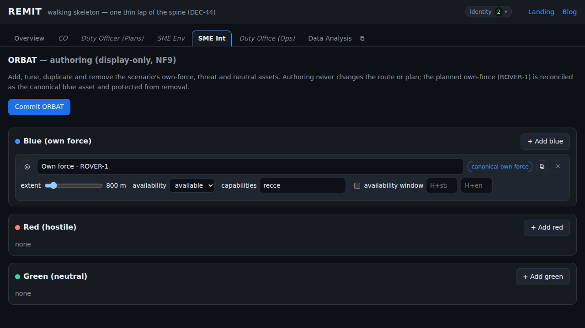
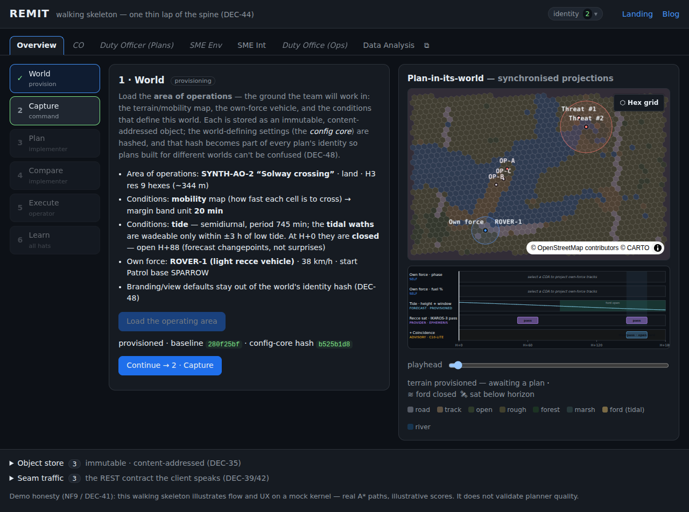
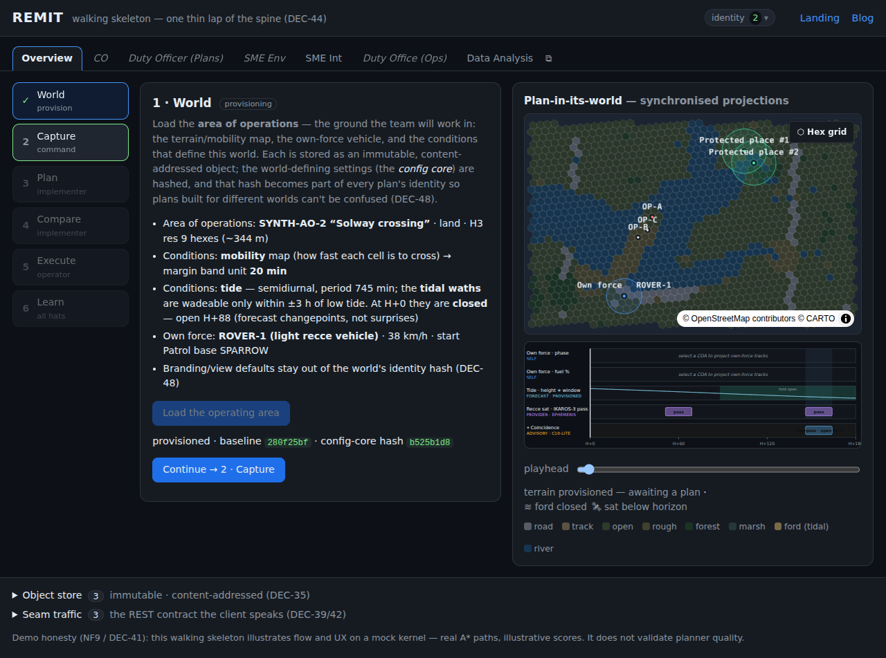
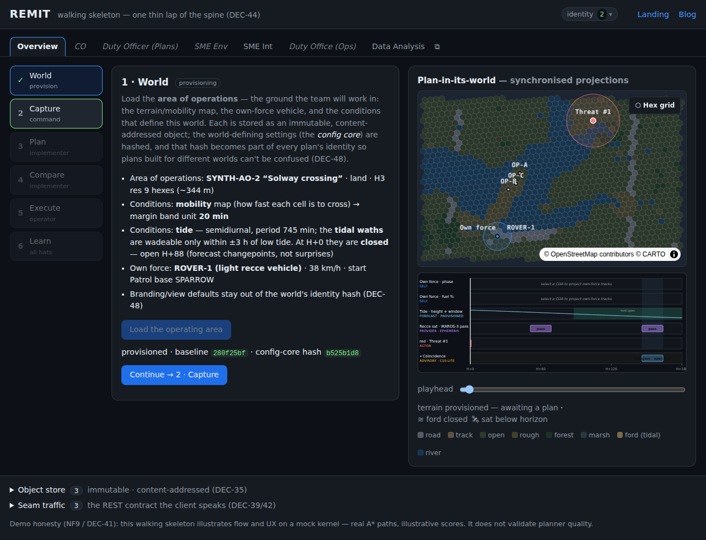

> **At a glance —** the ORBAT now carries all three sides: drop in as many own-force, threat
> and protected-place assets as a scenario needs, tune each one, and watch them appear on the
> map and the Sync Matrix — without a single one touching the route.

## The problem

REMIT's entity catalogue was fixed in config and seeded only a *single* own force. A planner
could describe where their vehicle started — and nothing else. There was no way to express the
own-force **pool**, the **adversary**, or the **neutral** picture (the no-strike places, the
civilian sensitivities) that every real scenario carries. The whole left-hand side of the
order of battle was simply missing, and the serialisable shape for it had to live *somewhere*
defensible.

## Options

- **A new object family vs. reusing Entity.** We could mint bespoke `ThreatMarker` / `RoeZone`
  types — or treat every asset as a first-class **Entity** (DEC-52) that simply carries an
  `allegiance`. A parallel family would duplicate the map / Sync-Matrix projection machinery
  and break the "one ontology, three stances" symmetry of DEC-60.
- **Free-form map drawing vs. a tunable roster.** A draw-on-the-map surface is fun but
  illegible past a handful of assets; a grouped **roster with per-instance tuners** stays
  readable at ten-plus per side.
- **Where the data lives — hand-written vs. generated.** The persisted ORBAT is serialisable
  object-core, so it is exactly what LinkML owns (Principle I). Hand-authoring the shape in
  `app/js` would be the re-listing anti-pattern.
- **Blue: display-only vs. wired into the planner.** Should authoring a blue pool asset change
  routing? Not in v1 — the honest floor (NF9) forbids fabricated behaviour, and reactive
  adversaries / capability-matched allocation are deferred capabilities.

## The strategy

Reuse **Entity + allegiance** and **schema-define the shape, then regenerate**. We added an
`Allegiance` enum (`blue|red|green`) and an optional `allegiance` attribute to `Entity`, plus a
new `schema/orbat.yaml` module (`Orbat`, `Asset`, `Blue/Red/GreenParams`, a `Protection` enum),
reusing the existing `Waypoint` / `Lineage` / `TimeWindow`. `bash schema/generate.sh` re-emits
the JSON Schema, the TypeScript types and the HTML reference; the app imports the generated
types and never re-lists them.

All three sides are **display-only authoring scaffolding** under the DEC-56 horizon split and
the NF9 honest floor. The model module (`app/js/orbat/orbat.js`) is a pure, deterministic
writer — `add` / `duplicate` / `tune` / `remove` / `validate` / `canonical` / `commit` — and the
authoring panel (`app/js/shell/orbat-panel.js`, the **SME-Int** role-tab) and the map read
through it. Crucially, **blue does not drive routing**: the existing planned own-force (ROVER-1)
is *reconciled* as the single `canonical_own_force` blue asset — protected from removal — and
keeps driving the plan via the pre-existing machinery. Everything projects through the existing
entity → map / Sync-Matrix path rather than a parallel renderer.

## The results

- **Add / duplicate / tune / remove** multiple independent instances of each allegiance, each an
  allegiance-coloured map marker (point + faint extent ring + label): blue `#4493f8`, red
  `#ff7b72`, green `#38d39f`.
- **Sync-Matrix tracks** for time-windowed assets (a red patrol window, a blue availability
  window), aligned with the shared playhead; selecting a row highlights it in both views.
- **Persistence:** the working draft mirrors to `localStorage` and survives reload exactly;
  committing mints an immutable, content-addressed `Orbat` with lineage.
- **The invariants hold, and the tests prove it:** tuning *anything* — including a blue asset —
  leaves the committed Plan ids byte-for-byte identical (display-only, NF9), and equal rosters
  canonicalise to equal bytes regardless of insertion order (NF3). **11 new unit tests** and
  **5 new e2e tests** (one per user story) are green, alongside the existing suites.

## Screenshots

The authoring panel — three allegiance groups, the canonical own-force surfaced and protected:

Two red threat assets placed and tuned (extent + severity) on the Solway map:

Green neutral assets, styled distinctly from red and own force:

A red asset with an active window projects as a Sync-Matrix track, synchronised with the playhead:

