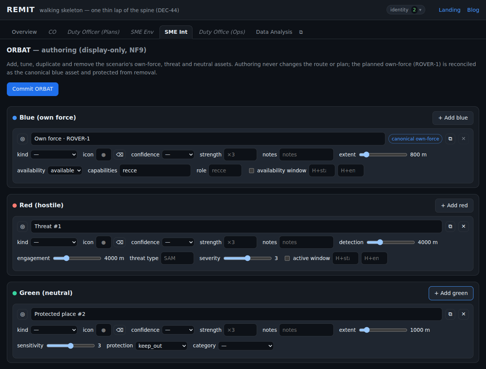
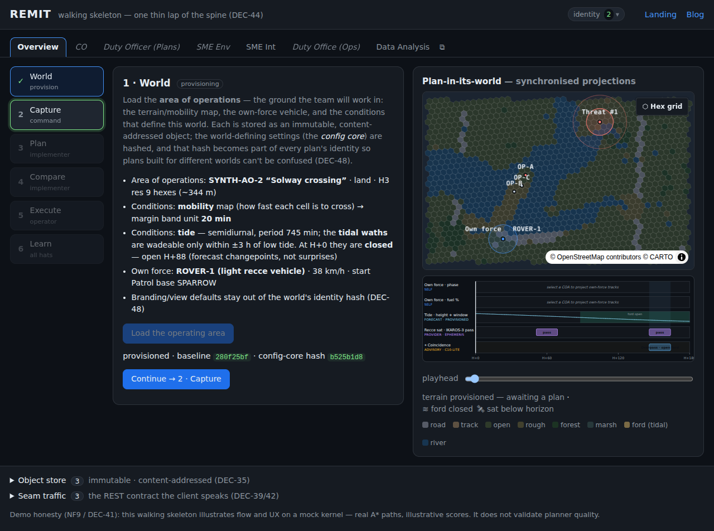

> **At a glance —** ORBAT assets gain typed NATO-style symbols, an intel-confidence wash, a threat's
> see-it-vs-hit-it rings, and lightweight descriptive detail — and *every* one of them stays
> honest-floor display-only: nothing touches the route.

## The problem

[Spec 004](../004-orbat-red-green-assets/) gave us a working ORBAT: add, tune, duplicate, remove and
commit blue/red/green assets. But every asset rendered as the *same* allegiance-coloured dot with a
*single* extent ring. You couldn't tell a hospital from a SAM site, a high-confidence sighting from a
rumour, or where a threat could **see** you versus where it could **hit** you. The picture had the
right sides but none of the texture an intelligence officer actually reasons with.

## Options

- **Symbology: an engine vs a lookup.** A full NATO APP-6/MIL-STD-2525 symbology engine (with
  affiliation frame shapes) — or a compact glyph **lookup table** keyed to a handful of platform kinds.
- **Rendering: icon atlas vs glyphs.** deck.gl's `IconLayer` with a bundled icon-atlas image — or a
  `TextLayer` drawing a Unicode/emoji **glyph** over the existing marker (no asset, no new dependency,
  no build step).
- **Confidence: a new scale vs reuse.** Invent a 0–1 confidence number — or reuse the project's
  existing `ConfidenceLevel` (high/medium/low) vocabulary.
- **Threat reach: one extent vs two.** Keep a single radius — or split it into a **detection** ring and
  an **engagement/weapon** ring on the hostile parameter group.

## The strategy

**Additive, schema-first, and display-only.** Every new field is authored in the LinkML schema
(Principle I) and regenerated — a `PlatformKind` enum and `kind`/`symbol`/`confidence`/`strength`/
`notes` on `Asset`; `detection_range_m`/`engagement_range_m`/`threat_type` on `RedParams`; a
`GreenCategory` enum + `category` on `GreenParams`; `role` on `BlueParams`. The app imports the
generated types and never re-lists them.

Symbols are **`TextLayer` glyphs** from a hand-written `SYMBOLS` lookup (the documented UI carve-out),
drawn over the allegiance-coloured marker — no icon atlas, no new runtime dependency, no build step.
Intel **confidence** becomes marker **opacity** (high→full, medium→0.6, low→0.35). Red's reach splits
into a faint outer **detection** ring and a bold inner **engagement** ring, with the model enforcing
`engagement ≤ detection`. And because spec-004 drafts already live in users' browsers, a pure,
idempotent `normalize()` **migrates** them on load — a red asset's old single `extent_m` becomes its
detection range, with an engagement ring seeded inside it.

Crucially, **nothing crosses the honest floor (NF9)**: not one enriched attribute is read by the
kernel or any plan. An e2e test re-asserts that tuning any of them leaves the committed plan ids
byte-for-byte identical.

## The results

- **Typed symbols** across all three sides (infantry/vehicle/aircraft/vessel/sensor/emplacement/
  structure), overridable per asset.
- **Intel confidence** as a pre-attentive opacity wash on the map.
- **Red dual range rings** — detection vs engagement — with the engagement ring never drawn larger than
  detection.
- **Descriptive detail** — strength, notes, red threat-type, green category, blue role — shown in the
  roster and on the marker hover tooltip.
- **Backward compatible**: spec-004 ORBATs load intact and migrate cleanly.
- **The invariants hold, and the tests prove it**: **12 new unit tests** (30 total) and **4 new e2e
  tests** (9 total) are green, alongside `0` typecheck errors. Determinism (NF3) and the honest floor
  (NF9) are both asserted.

## Screenshots

The enriched authoring panel — kind, icon override, confidence, strength, notes; red shows detection +
engagement (the single extent is gone for red); green/blue keep their single extent:

The map reads like a recognised picture — typed allegiance symbols in place of plain dots:

